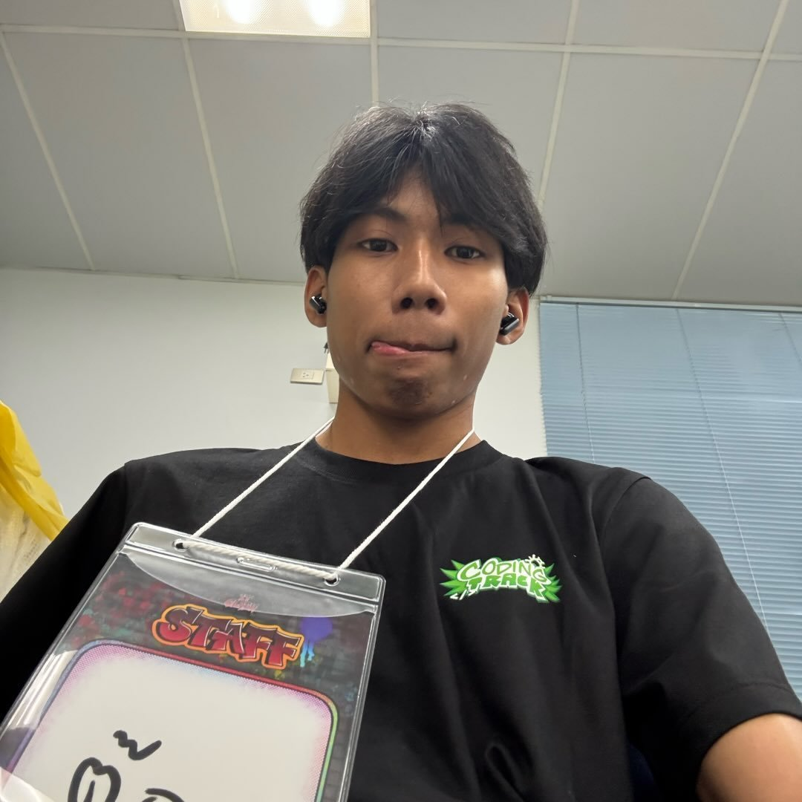

# Physical Computing Project 2026 - IT KMITL

## Overview
Flappy Your Sound คือ

## ❓ ปัญหาที่โปรเจกต์นี้ต้องการแก้

1. **ปัญหาด้านการควบคุมเกม**
   Flappy Bird ปกติเล่นด้วยการคลิกเมาส์หรือแตะหน้าจอ โปรเจกต์นี้เปลี่ยนเป็นการควบคุมด้วยเสียง (เช่น ตบมือ) ผ่านฮาร์ดแวร์จริง
2. **ปัญหาด้านการเชื่อมต่อฮาร์ดแวร์กับเว็บ**
   ทำอย่างไรให้ Arduino ส่งข้อมูลจากเซนเซอร์ไปควบคุมเกมบนเว็บเบราว์เซอร์แบบ Real-time โดยไม่ต้องใช้สาย Serial และไม่ต้องใช้ MQTT broker
3. **ปัญหาด้านการเรียนรู้**
   เป็นตัวอย่างที่รวม IoT, Web และ Game Development เข้าด้วยกัน และแสดงการแบ่งหน้าที่ระหว่างอุปกรณ์กับซอฟต์แวร์อย่างชัดเจน

## 💡 ความสำคัญของปัญหา

- **Physical Computing / IoT:** การให้อุปกรณ์จริงสื่อสารกับแอปแบบ Real-time เป็นพื้นฐานของระบบ IoT เช่น สมาร์ทโฮมและระบบควบคุมอุตสาหกรรม
- **Accessibility:** การควบคุมด้วยเสียงเป็นทางเลือกสำหรับผู้ที่ใช้เมาส์หรือคีย์บอร์ดได้ลำบาก
- **สถาปัตยกรรม:** หลักการ "Arduino คือ controller, Next.js คือเกม, WebSocket คือสะพานเชื่อม" เป็นแนวคิดแยกส่วน (Separation of Concerns) ที่นำไปใช้กับระบบจริงได้
- **Low latency:** เกมต้องตอบสนองเร็ว WebSocket เหมาะกว่า HTTP polling

## 👥 ใครได้ประโยชน์

| กลุ่ม | ประโยชน์ที่ได้รับ |
|---|---|
| นักเรียน/นักศึกษา | เรียนรู้ Arduino, WebSocket, Next.js และ Canvas ในโปรเจกต์เดียว |
| ผู้สอน/ครู STEM | ใช้เป็นสื่อการสอนที่สนุกและเห็นผลทันที |
| Maker / นักพัฒนามือใหม่ | ใช้เป็นต้นแบบต่อยอดไปทำ controller แบบอื่น |
| ผู้เล่นทั่วไป | ได้เล่นเกมในรูปแบบใหม่ด้วยเสียง |
| AI agents / ผู้ดูแลโปรเจกต์ | มีกฎ (Rules 1–7) ชัดเจน แก้โค้ดได้โดยไม่ทำลายสถาปัตยกรรม |

## 🛠️ โปรเจกต์นี้แก้ปัญหาได้อย่างไร

แก้ด้วยสถาปัตยกรรม 3 ส่วนที่แยกหน้าที่ชัดเจน

1. **Arduino UNO R4 WiFi (ผู้รับ input จากโลกจริง)**
   อ่านค่าเสียงจาก Sound Sensor ที่ขา `A0` ถ้าค่าเกิน `SOUND_THRESHOLD` (650) จะส่ง `{"type":"jump"}` โดยมี cooldown 200 ms กันการกระโดดซ้ำ และเชื่อมต่อใหม่อัตโนมัติถ้าหลุด
2. **Node.js WebSocket Server (ตัวกลาง)**
   รันที่พอร์ต 8080 รับข้อความจาก Arduino แล้ว broadcast ให้เบราว์เซอร์ทุกตัวที่เชื่อมต่ออยู่
3. **Next.js + HTML5 Canvas (ตัวเกม)**
   เบราว์เซอร์เป็นเจ้าของ game state ทั้งหมด (ตำแหน่งนก, ท่อ, การชน, คะแนน, Game Over) เมื่อได้รับ `jump` จะตั้ง `velocity = jumpPower` (-8) แล้ววนลูปด้วย `requestAnimationFrame` เพื่ออัปเดตฟิสิกส์ ตรวจจับการชน และวาดภาพ

นอกจากนี้กด `SPACE` เพื่อทดสอบเกมโดยไม่ต้องมี Arduino ได้

## 📥 Input / 📤 Output

### Input

| แหล่ง | รายละเอียด |
|---|---|
| **หลัก (ฮาร์ดแวร์)** | ค่า Analog จาก Sound Sensor ที่ขา `A0` (เสียงเงียบ ≈ 420–440, เสียงตบมือ ≈ 720–910) |
| **รอง (ซอฟต์แวร์)** | กดปุ่ม `SPACE` บนคีย์บอร์ดเพื่อทดสอบ |
| **ผู้ใช้** | คลิกปุ่ม Restart เมื่อเกมจบ |

ข้อความ JSON ที่ส่งผ่าน WebSocket: `arduino` (สถานะเชื่อมต่อ), `sound` (ค่าเสียงดิบ), `jump` (คำสั่งกระโดด)

### Output

| ส่วน | รายละเอียด |
|---|---|
| ภาพเกมบน Canvas (400×600) | พื้นหลัง, ท่อ, นก, คะแนน |
| การตอบสนองของนก | กระโดดขึ้นทันทีเมื่อเสียงเกินเกณฑ์ แล้วตกตามแรงโน้มถ่วง |
| ข้อมูลสถานะบนหน้าจอ | ระดับเสียงปัจจุบัน, สถานะการเชื่อมต่อ Arduino, คะแนน |
| หน้า Game Over | แสดง "GAME OVER", คะแนนสุดท้าย และปุ่ม Restart |

```text
Input:  เสียงจริง (ตบมือ) → ค่า analog จาก A0
Output: นกใน Flappy Bird กระโดดบนหน้าจอเบราว์เซอร์ + คะแนน + สถานะเกม
```

<table>
  <tr>
    <th width="110">Student ID</th>
    <th width="300">Name</th>
    <th width="450">Duty</th>
    <th width="80">Percent</th>
    <th width="170">Image</th>
  </tr>
  <tr>
    <td>68070124</td>
    <td>นายพิชญ์พงศ์ บุญดี</td>
    <td>Hardware + ต่อวงจร + Microphone Sensor + ทดสอบการรับเสียง</td>
    <td>25%</td>
    <td></td>
  </tr>
  <tr>
    <td>68070125</td>
    <td>นายพิชัยยุทธ ขวัญบุญ</td>
    <td>ทดสอบระบบ + ปรับความยาก + จัดทำรายงาน/สไลด์ + เตรียมนำเสนอ</td>
    <td>25%</td>
    <td></td>
  </tr>
  <tr>
    <td>68070153</td>
    <td>นายยศวัฒน์ อิ่มใจ</td>
    <td>ออกแบบระบบ + เขียนโปรแกรมหลักของเกม + ระบบการเคลื่อนที่</td>
    <td>25%</td>
    <td></td>
  </tr>
  <tr>
    <td>68070180</td>
    <td>นายสันต์ทัศน์ เชาว์กิติวุฒิ</td>
    <td>ออกแบบ UI/กราฟิก OLED + ระบบคะแนน + Collision/Game Over</td>
    <td>25%</td>
    <td></td>
  </tr>
</table>

